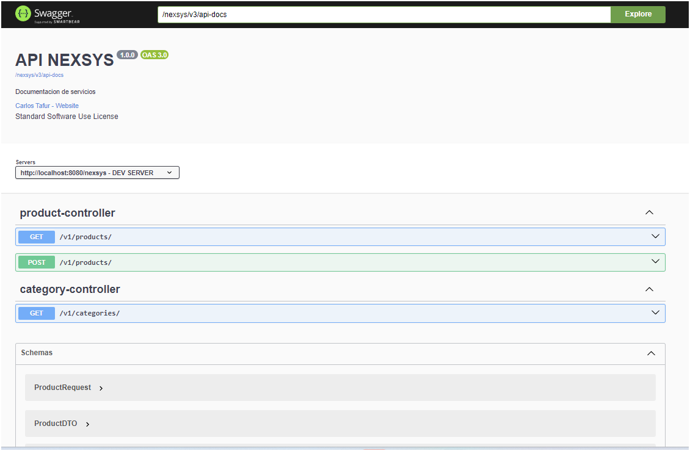

# Spring-boot with OpenAPI NEXSYS applications.

## [Demo Spring Boot 3 Web MVC ](http://localhost:8080/nexsys/swagger-ui/index.html#/).

# **Thank you for the support**

* Thanks a lot [JetBrains](https://www.jetbrains.com/?from=springdoc-openapi) for
  supporting springdoc-openapi project.

